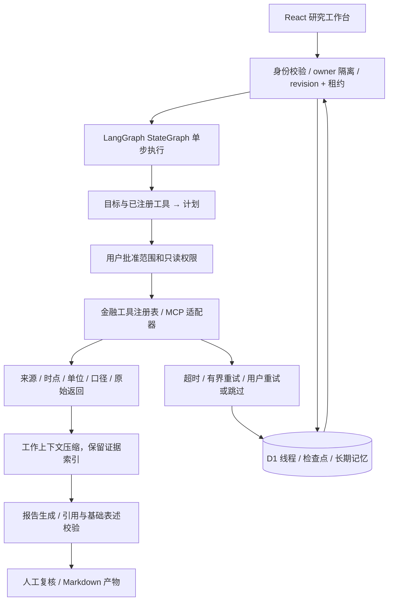

# 架构与评测要求映射

| 题目要求 | 实现位置／行为 |
| --- | --- |
| 能力与工具注册 | `lib/harness/engine.ts` registry；runtime 将未配置工具标记不可用 |
| 计划执行 | live 使用模型结构化规划并校验 allowlist；demo 为明确标注的确定性流程 |
| Agent Harness | LangGraph 控制单步；应用层处理审批、预算、工具、记忆、恢复和报告验证 |
| 上下文压缩 | 压缩为目标、记忆、证据索引和未完成事项；原始证据另存 state |
| 长期记忆 | D1 owner 隔离文本；用户勾选确认后保存，下一线程注入 |
| 检查点与恢复 | D1 每步快照，原子批处理，历史恢复保留累计预算 |
| 权限与审批 | 平台身份头；所有查询加 owner；工具只读 allowlist；计划审批；报告复核 |
| 停止规则 | 步骤边界 pause/stop；终态不执行；调用、Token、执行时间上限 |
| 成本／时延 | 真实模型 usage；逻辑调用计数；累积耗时；每请求超时；全站 25 次模型请求／$1 保守预占，执行前原子扣除 |
| 可观测性 | 可见 event trace、attempts、错误、耗时、usage、版本与证据质量 |
| 动态 UI | 按 RunState.status 呈现计划确认／执行／恢复／复核操作 |
| 失败降级 | 工具一次重试后暂停；用户明确 skip 保留缺口；不静默生成正常结论 |
| 可验证成果 | 每条结论关联 E 编号，展示原始 JSON 与来源等元数据；导出 Markdown |

数据库写入使用参数化 SQL。租约避免同线程并发调用；revision 防止 stale 客户端覆盖。恢复是应用层状态回放，不提供外部请求 exactly-once。

OpenAI 与扶摇 REST 已完成真实联调；iFinD 接入所需 URL、工具名、schema、鉴权和时点字段由实际服务能力决定，不自行猜测。

## 第二版真实接入准备

扶摇 REST 只使用官方 allowlist 路径：估值 `GET /api/a-share/valuations/snapshot`、合并利润表 `GET /api/a-share/financials/income-statements`。原始业务信封完整保留；HTTP 200 不代表成功，必须 `code===0`。验证标的匹配、所选财政年度、人民币与 EPS 单位、空值和时点；缺失字段不补零。

OpenAI 使用 Responses API 纯文本 JSON 输出。全站 model_budget 原子预占后发请求，不自动重试。历史恢复不接触预算表，超限拒绝请求。没有浏览器修改预算的接口。额度未配置真实 Key 前不会发生付费。

## RSI（Recursive Self-Improvement）

报告草稿进入隔离状态，新增 critique 与 revise 阶段形成有界递归。结构化自检反馈与独立确定性规则共同决定是否修订；最多两次自检、一次修订。通过后交给用户复核，未通过则扣留。没有自主改写代码或扩大权限，已有成本、停止、记忆审批和检查点规则持续生效。见 RSI.md。
